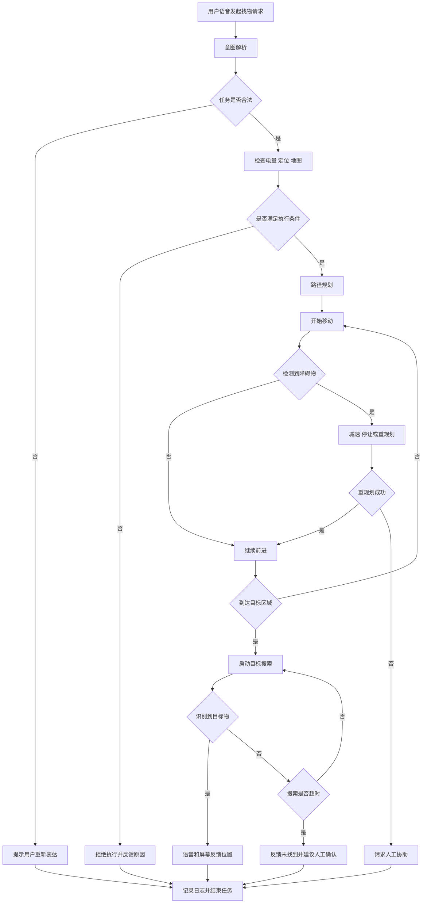

# 家庭陪护机器人避障与找物功能 PRD

## 1. 文档信息

| 项目 | 内容 |
| :--- | :--- |
| 文档名称 | 家庭陪护机器人避障与找物功能 PRD |
| 版本 | V1.0 |
| 产品阶段 | 第一版验证型功能 |
| 适用对象 | 产品、算法、导航、客户端、测试、运维 |
| 文档目标 | 明确家庭陪护机器人在室内执行找物任务时的避障、搜索、反馈与异常处理要求 |

---

## 2. 项目背景

在家庭陪护场景中，老人或行动不便用户经常会遇到“常用物品一时找不到”的问题，例如药盒、水杯、遥控器、纸巾盒。这类任务频次高、任务本身不复杂，但对用户的打断感很强。

现阶段家庭陪护机器人的价值，不应一上来就定义成“自主抓取并递送所有物品”，而应先聚焦在一类高频、低风险、可验证的任务上，形成稳定可复用的导航、避障和目标物搜索能力。

本 PRD 针对的就是这一类第一版核心功能：

**用户通过语音发出找物请求，机器人在家庭预设区域内安全移动，避开静态和动态障碍物，在目标区域搜索指定物品，并以语音和屏幕形式反馈结果。**

---

## 3. 产品目标

### 3.1 业务目标

1. 降低老人查找高频常用物品的时间成本
2. 提高陪护机器人在家庭场景中的基础实用性
3. 为后续抓取、递送、远程协助等高级能力建立底层任务闭环

### 3.2 用户目标

1. 用一句自然语言即可发起找物请求
2. 机器人在移动过程中不撞人、不冒进、状态可理解
3. 找不到物体时，机器人能明确说明原因，而不是沉默或卡住

### 3.3 产品目标

1. 支持语音触发找物任务
2. 支持家庭预设区域内自主导航与避障
3. 支持四类高频目标物的搜索与反馈
4. 支持失败降级与人工协助提示

---

## 4. 目标用户与使用场景

### 4.1 目标用户

1. 独居老人
2. 行动受限但有基础语言表达能力的老人
3. 家庭照护者

### 4.2 使用场景

1. 老人在客厅找不到遥控器，希望机器人帮助定位
2. 老人在卧室内需要寻找药盒，希望机器人前往并协助确认位置
3. 家属不在身边时，机器人承担基础寻物和状态反馈功能

### 4.3 典型用户语句

1. 帮我找一下药盒
2. 去客厅看看遥控器在哪
3. 帮我找纸巾盒
4. 帮我看看水杯是不是在餐桌上

---

## 5. 版本范围

### 5.1 本版本包含

1. 语音指令接收与任务意图解析
2. 执行前状态检查，包括电量、定位、地图状态
3. 家庭预设区域内的自主导航
4. 行进中的静态与动态避障
5. 到达目标区域后的目标物搜索
6. 语音播报和屏幕反馈
7. 任务失败后的降级处理与日志记录

### 5.2 本版本不包含

1. 机械臂抓取与递送
2. 开放词表的任意目标物识别
3. 跨楼层导航
4. 室外场景执行
5. 极暗环境下的高精度视觉定位
6. 多轮复杂自然语言对话规划

### 5.3 版本边界原则

第一版优先保证“任务可发起、路径可执行、过程安全、结果可反馈”，不追求全能化。

---

## 6. 需求拆解框架

### 6.1 Task

1. 接收找物任务
2. 判断是否具备执行条件
3. 前往目标区域
4. 在移动过程中完成安全避障
5. 在目标区域完成目标物搜索
6. 将搜索结果反馈给用户
7. 失败时进入降级流程

### 6.2 Environment

1. 家庭走道较窄，存在家具腿、拖鞋、电线等静态障碍物
2. 人、宠物、轮椅、助行器会随机移动
3. 地面可能包含地毯、门槛和反光区域
4. 白天夜晚光照变化明显
5. Wi-Fi 覆盖并不均匀

### 6.3 Capability

1. 语音识别与基础意图解析
2. 室内定位与路径规划
3. 静态障碍物检测
4. 动态障碍物检测与减速停让
5. 目标物识别与结果确认
6. 可解释的语音与屏幕反馈
7. 数据日志记录与异常上报

---

## 7. 用户故事

### 用户故事 1

作为一名行动不便的老人，我希望只通过语音就能让机器人帮我查找常用物品，这样我不需要自己反复起身寻找。

### 用户故事 2

作为一名家庭照护者，我希望机器人在家庭狭窄空间里移动时足够保守和安全，这样我才敢长期让它在老人身边运行。

### 用户故事 3

作为一名用户，我希望机器人在找不到目标物时，能明确告知是未识别到、被遮挡还是当前无法执行，而不是一直无响应。

---

## 8. 功能流程概览

### 8.1 主流程

1. 用户发起语音找物请求
2. 系统解析目标物和目标区域
3. 系统检查当前电量、定位、地图状态
4. 若满足条件，则规划路径并开始移动
5. 行进过程中持续进行避障检测与重规划
6. 到达目标区域后启动视觉搜索
7. 搜索成功则反馈物体位置
8. 搜索失败则说明原因并给出建议
9. 任务完成后记录日志

### 8.2 流程图

---

## 9. 功能需求明细

## 9.1 语音任务下发

### 功能描述

用户可通过语音触发找物任务，系统识别目标物类别及可选区域信息。

### 输入示例

1. 帮我找药盒
2. 去客厅找遥控器
3. 帮我看看水杯在哪

### 处理要求

1. 支持目标物关键词识别：药盒、遥控器、水杯、纸巾盒
2. 若识别到明确区域信息，则优先前往对应区域
3. 若物体类别不在支持范围内，则提示当前版本暂不支持
4. 若语句存在歧义，则发起一次二次确认

### 验收要求

1. 目标物类别识别成功率不低于 95%
2. 歧义任务必须进入二次确认，不允许直接误执行

## 9.2 执行前状态检查

### 功能描述

机器人在开始执行任务前，必须完成基础状态校验。

### 检查项

1. 电量是否高于任务启动阈值
2. 当前定位状态是否正常
3. 地图是否可用
4. 当前是否处于故障或人工接管状态

### 处理要求

1. 若电量低于阈值，则拒绝执行并提示先回充
2. 若定位异常，则提示当前无法执行任务
3. 若系统处于人工接管状态，则不接受新任务

## 9.3 导航与避障

### 功能描述

机器人根据目标区域进行路径规划，并在移动过程中持续处理静态与动态障碍物。

### 处理要求

1. 默认采用保守策略，优先安全而非最短时间
2. 检测到静态障碍物时进行局部绕行或重规划
3. 检测到动态障碍物时优先减速或停车
4. 连续重规划失败达到阈值后，进入人工协助流程

### 关键原则

1. 不允许为缩短路径而贴边高速通过
2. 不允许在近距离有人体目标时强行绕行
3. 电梯口、转角、窄道等高风险区域采用更保守的速度配置

## 9.4 目标物搜索

### 功能描述

机器人到达目标区域后，对视野内目标物进行搜索与确认。

### 处理要求

1. 首先在用户指定区域的主要平面进行搜索
2. 若首次未识别到，则执行多视角二次搜索
3. 若识别置信度不足，则提示可能被遮挡或环境光照不足
4. 搜索超时后结束当前任务，进入失败反馈流程

### 结果反馈要求

1. 若成功识别，需用语音告知目标物所在区域描述
2. 屏幕上显示目标物名称、位置描述和置信状态
3. 若失败，必须说明失败原因类别

## 9.5 任务结果反馈

### 成功反馈

1. 已找到药盒，位于客厅茶几右侧
2. 已找到遥控器，位于沙发左扶手附近

### 失败反馈

1. 当前未找到药盒，可能被遮挡，请人工确认
2. 当前路径受阻，无法继续执行，请清理通道后重试
3. 电量不足，已暂停任务并准备回充

---

## 10. 异常处理与降级策略

| 异常场景 | 触发条件 | 系统动作 | 用户反馈 | 日志要求 |
| :--- | :--- | :--- | :--- | :--- |
| 路径长期阻塞 | 同一路段连续 3 次重规划失败 | 停车并请求人工协助 | 当前通道受阻，请协助清理 | 记录地图位置、重规划次数 |
| 动态障碍物逼近 | 人或宠物进入近距离安全区 | 减速或停车 | 前方有人体目标，正在等待通行 | 记录时间点与传感器快照 |
| 目标物未识别 | 搜索超时仍未找到 | 结束搜索并反馈失败 | 当前未找到目标物，可能被遮挡 | 保存识别截图和置信度 |
| 电量不足 | 启动前或执行中低于阈值 | 拒绝任务或中断返航 | 电量不足，当前任务已暂停 | 记录电量曲线和任务阶段 |
| 指令歧义 | 目标物类别不明确 | 发起二次确认 | 请问您要找的是药盒还是纸巾盒 | 记录原始语音文本 |
| 定位异常 | 无法稳定定位 | 停止执行 | 当前定位异常，无法继续执行 | 记录定位状态码 |

### 降级原则

1. 任何涉及近距离人体风险的情况，优先停车
2. 任何涉及定位不确定的情况，不允许盲目前进
3. 任何涉及低电量风险的情况，优先保证返航安全
4. 任何超过设定重试次数的情况，必须进入人工协助而不是无限循环

---

## 11. 数据记录要求

为了支持后续算法和产品迭代，本功能需沉淀以下数据：

1. 每次任务的目标物类型、目标区域和执行结果
2. 任务耗时、路径长度、重规划次数
3. 避障触发次数与类型分布
4. 识别失败时的图像快照、置信度和环境标签
5. 人工接管前 30 秒的系统状态日志
6. 用户二次确认与重新表达的发生频率

这些数据后续用于：

1. 识别长尾场景
2. 优化目标物识别策略
3. 优化路径保守性参数
4. 优化人机交互提示文案

---

## 12. 非功能需求

### 12.1 安全性

1. 必须支持近距离动态障碍物减速或停车
2. 必须支持人工急停机制
3. 必须避免在高风险区域激进穿行

### 12.2 稳定性

1. 任务执行过程不应因单次误识别直接崩溃
2. 所有异常必须有明确降级路径

### 12.3 可解释性

1. 用户必须能理解当前处于什么状态
2. 失败时必须知道为什么失败、下一步做什么

### 12.4 可测试性

1. 每项核心能力都必须定义可量化指标
2. 异常场景必须有可复现实验用例

---

## 13. 验收指标

| 指标 | 目标值 | 说明 |
| :--- | :--- | :--- |
| 任务发起成功率 | >= 98% | 有效语音请求成功进入执行流程 |
| 目标区域到达成功率 | >= 95% | 在预设区域内顺利到达 |
| 动态避障安全率 | >= 98% | 无碰撞完成减速、停让或绕行 |
| 目标物识别成功率 | >= 85% | 限定四类目标物 |
| 人工接管率 | <= 10% | 每 100 次任务的人工介入占比 |
| 平均任务时长 | <= 180 秒 | 从任务下发到结果反馈 |
| 异常可解释反馈覆盖率 | = 100% | 所有失败场景必须有明确反馈 |

---

## 14. 依赖项

1. 室内地图已预构建并可用
2. 语音模块具备基础关键词识别能力
3. 导航模块支持局部重规划
4. 视觉模块支持四类目标物识别
5. 客户端或屏幕模块支持状态展示

---

## 15. 风险与待确认项

1. 四类目标物是否足以覆盖真实高频需求，需用户调研确认
2. 家庭弱光环境是否需要补充红外或补光能力，需硬件评估
3. 宠物场景下的避障策略是否需要独立参数配置，需测试验证
4. 屏幕反馈是否足够适合老人理解，需做可用性测试
5. 用户是否更需要“找物定位”还是“找物后呼叫家属”，需进一步确认业务优先级

---

## 16. 测试用例建议

### 用例 1：正常找物

输入：帮我找药盒

预期：机器人成功前往预设区域，识别药盒并播报位置。

### 用例 2：路径被阻塞

输入：去客厅找遥控器

环境：中途走道放置障碍物且不可绕行。

预期：机器人连续重规划失败后停止前进，提示人工协助。

### 用例 3：动态障碍物闯入

输入：帮我找纸巾盒

环境：移动途中有人从侧面近距离经过。

预期：机器人减速或停车，待通行后继续。

### 用例 4：目标物被遮挡

输入：帮我找水杯

环境：水杯被遮挡在物体后方。

预期：机器人进行二次搜索，超时后提示可能被遮挡。

### 用例 5：低电量中断

输入：帮我找遥控器

环境：任务进行中电量降到安全阈值以下。

预期：机器人终止任务，提示电量不足并返航。